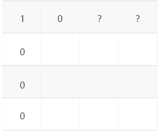

# [10. 正则表达式匹配](https://leetcode-cn.com/problems/regular-expression-matching/)

难度：<font color=#f00> 困难 </font>

给你一个字符串 `s` 和一个字符规律 `p`，请你来实现一个支持 `'.'` 和 `'*'` 的正则表达式匹配。

`'.'` 匹配任意单个字符
`'*'` 匹配零个或多个前面的那一个元素
所谓匹配，是要涵盖 整个 字符串 `s` 的，而不是部分字符串。

## 分析

首先，题目给出了三种字符，它们分别是`'*'` `'.'` `'a-z'`

人类在观察正则表达式的时候是从左往右，在左侧能够匹配是右侧能够匹配的必要条件。

**定义状态**

因此我们可以用动态规划的方法，定义一个二维数组`dp[i][j]`, 表示 `s[:i]` 和 `p[:j]` 是否匹配

这里我们要强调一下，`s[:i]` 和 `p[:j]` 表示从`0`开始长度为`i`和`j`的子串。

**状态初始化**

对于`dp[i][j]` 我们可以知道，当$i=j=0$ 的时候，必然是匹配的。

```cpp
dp[0][0] = true //单独初始化
```

第`0`列`dp[i][0]` 除了 $i=0$ 的时候，其他都是不匹配的。

```cpp
dp[i][0] = false //定义dp的时候自动赋值
```

 第`0`行`dp[0][j]`比较特殊，需要用到状态转移。

```cpp
dp[0][j] = dp[0][j-2]&&p[j-1]=='*'
//可以这样理解，在p[:j-3]与空字符串匹配的情况下，必须有p[j-2] 被 p[j-1] = '*' 消掉
//至于p[j-2]是什么就不重要了
```



**状态转移**

初始化完成以后，需要完整的列出状态转移公式。

对于`dp[i][j]` ，如果p[j-1] = `'*'`

- `'*'`表示0个`p[j-2]`字符的条件：`dp[i][j-2] = true` 即不需要这个`'*'` 和它前面的一个字符，就可以实现匹配。
- `'*'`表示1个`p[j-2]`字符：`dp[i-1][j-2] = true` 且 `s[i-1] == p[j-2] || p[j-2] = '.'`
- `'*'`表示n个`p[j-2]`字符：`dp[i-1][j] = true` 且 `s[i-1] == p[j-2] || p[j-2] = '.'`

可以返现第二种情况被第三种情况涵盖了：

​	在`p[j-1]`为`'*'`的情况下，当`dp[i-1][j]`为真的时候 `s[i-2]` 可能等于 `p[j-2]` 也可能不等于，即包含了`'*'`表示`1-n`个字符情况。因此可以把情况二的判别省略。

- `dp[i][j-2] == true`
- `dp[i-1][j] == true && (s[i-1] == p[j-2] || p[j-2] = '.')`

如果p[j-1] != `'*'`

- `dp[i-1][j-1] == true && (s[i-1]==p[j-1] || p[j-1]=='.')`

**结果返回**

动态规划的结果位于`dp`矩阵的右下角`dp[s.size()][p.size()]`

##  代码

```cpp
class Solution {
public:
    bool isMatch(string s, string p) {
        //定义动态规划表
        vector<vector<bool>> dp(s.size()+1,vector<bool>(p.size()+1,false));
        //初始化
        dp[0][0] = true;
        for(int j = 2; j <= p.size(); ++j){
            dp[0][j] = dp[0][j-2]&&p[j-1]=='*';
        }
        //递推状态转移
        for(int i = 1; i <= s.size(); ++i){
            for(int j = 1; j <= p.size(); ++j){
                if(p[j-1]=='*'){
                    if(dp[i][j-2])
                        dp[i][j] = true;
                    else if(dp[i-1][j]&&(p[j-2]=='.'||s[i-1]==p[j-2]))
                        dp[i][j] = true;
                }
                else{
                    if(dp[i-1][j-1]&&(s[i-1]==p[j-1]||p[j-1]=='.'))
                        dp[i][j] = true;
                }
            }
        }
        //返回结果
        return dp[s.size()][p.size()];
    }
};
```

