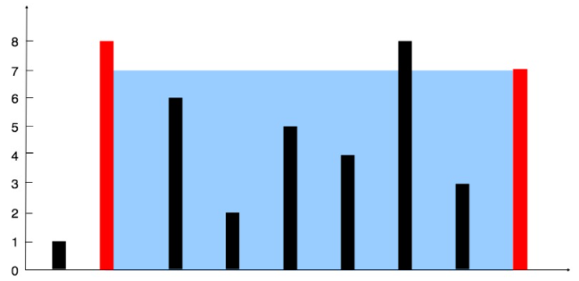

# 双指针

## 11.盛最多水的容器

> 给定 $n$ 个非负整数$a_1, a_2,\cdots,a_n$，每个数代表坐标中的一个点 $(i,a_i)$。在坐标内画 $n$ 条垂直线，垂直线 $i$ 的两端点分别为 $(i,a_i)$ 和 $(i,0)$。找出其中的两条线，使得它们与 $x$ 轴共同构成的容易可以容纳最多的水。

- 输入：[1,8,6,2,5,4,8,3,7]
- 输出：49
- 解释：图中垂直线代表输入数组 [1,8,6,2,5,4,8,3,7]。在此情况下，容器能够容纳水（表示为蓝色部分）的最大值为 49



> 此题使用双指针来解答，步骤如下：
>
> - 开始两个指针分别指向左右两端
> - 进入循环
> - 计算计算短板（这个表述来源于短板原理），并计算当前盛水量
> - 与结果保持器 ret 相比较，并将较大者赋值给 ret
> - 移动高度较小的一个指针（相互靠近）
>
> 理解：
>
> 算法的整体趋势是减小水桶的底边，并根据判断结果移动双指针中的一个高度较小的指针。那么为什么要移动高度较小的指针呢？
>
> 因为较小的指针所指的边在以后的循环中不可能参与到盛更多的水的容器中。有高度 $height$ 参与的水桶，该水桶的最大有效高度不超过 $height$


```cpp

class Solution {
public:
    int maxArea(vector<int>& height) {
        int res = 0,left = 0,right= height.size()-1;
        while(right > left){
            int lower = 0;
            if(height[left]>=height[right]){
                lower = height[right];
             	res = max(lower*(right-left),res);
                right--;
            }
            else{
                lower = height[left];
                res = max(lower*(right-left),res);
                left++;
            }
        }
        return res;
    }
    
    
};


```

## [15. 三数之和](https://leetcode-cn.com/problems/3sum/)

给你一个包含 `n` 个整数的数组 `nums`，判断 `nums `中是否存在三个元素 `a，b，c `，使得 `a + b + c = 0` ？请你找出所有和为 0 且不重复的三元组。

注意：答案中不可以包含重复的三元组。


**算法流程：**

1. 特判，对于数组长度 `n`，如果数组为 `null `或者数组长度小于 3，返回 []。
2. 对数组进行排序。
3. 遍历排序后数组：
   - 若 $nums[i]>0$：因为已经排序好，所以后面不可能有三个数加和等于 `0`，直接返回结果。
   - 对于重复元素：跳过，避免出现重复解
   - 令左指针 $L=i+1$，右指针 $R=n−1$，当 $L<R$ 时，执行循环：
     - 当$ nums[i]+nums[L]+nums[R]==0$，执行循环，判断左界和右界是否和下一位置重复，去除重复解。并同时将 $L,R$ 移到下一位置，寻找新的解
     - 若和大于 0，说明$ nums[R]$ 太大，$R$ 左移
     - 若和小于 0，说明 $nums[L]$ 太小，$L$ 右移

**复杂度分析：**

- 时间复杂度：$O(nlogn+n^2) = O(n^2)$
- 空间复杂度：$O(1)$

```cpp
class Solution {
public:
    vector<vector<int>> threeSum(vector<int>& nums) {
        vector<vector<int>> res;

        if(nums.size()<3) return {};

        sort(nums.begin(),nums.end());

        for(int i = 0; i < nums.size(); i++){

            if(i>0&&nums[i]==nums[i-1]){
                continue;
            }

            if(nums[i]>0) return res;

            int left = i+1;
            int right = nums.size()-1;

            while(left<right){
                int twoSum = nums[left]+nums[right];
                int target = -nums[i];

                if(twoSum > target){
                    right--;
                }
                else if(twoSum < target){
                    left++;
                }
                else{
                    res.push_back({nums[i],nums[left],nums[right]});

                    while(left < right && nums[left] == nums[left+1])
                        left++;
                    while(right > left && nums[right] == nums[right-1])
                        right--;
                    left++;
                    right--;
                }
                
            }
        }

        return res;
    }
};
```

