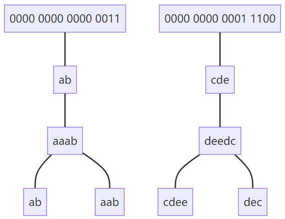
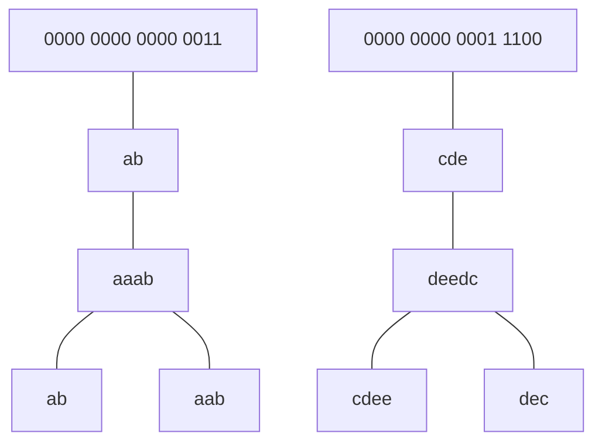

#### [318. 最大单词长度乘积](https://leetcode-cn.com/problems/maximum-product-of-word-lengths/)

给定一个字符串数组 words，找到 length(word[i]) * length(word[j]) 的最大值，并且这两个单词不含有公共字母。你可以认为每个单词只包含小写字母。如果不存在这样的两个单词，返回 0。

**示例 1:**

> **输入:** ["abcw","baz","foo","bar","xtfn","abcdef"]
> **输出: 16** 
> 解释: 这两个单词为 "abcw", "xtfn"。

**示例 2:**

> **输入:** ["a","ab","abc","d","cd","bcd","abcd"]
> **输出: 4** 
> 解释: 这两个单词为 "ab", "cd"。

**示例 3:**

> **输入:** ["a","aa","aaa","aaaa"]
> **输出: 0** 
> 解释: 不存在这样的两个单词。

字符串整数编码，加哈希表同组合并。

`[“aaab”,”ab”,”aab”,”cdee”,”deedc”,”dec”]`

这一题中我们可以把word划分为两个层面：





- 先将每个字符串编码为int
- 然后建立<int,int>的哈希表，first是编码，second是最大长度
- 最后嵌套遍历哈希表（此时哈希表的长度是独立组合的个数，如上图中的两个独立组合）

```cpp
class Solution {
private:
    int string2Int(string A)
    {
        int res = 0;
        for (auto a : A)
        {
            res |= (0x1 << a-'a');
        }
        return res;
    }
public:
    int maxProduct(vector<string>& words) {
        unordered_map<int,int> mp;
        int res = 0;
        //(chars, length)
        for(auto word : words){
            int temp = string2Int(word);
            if(mp.count(temp)){
                mp[temp] = max(mp[temp],(int)word.size());
            }
            else{
                mp[temp] = word.size();
            }
        }

        for(auto &a : mp){
            for(auto &b : mp){
                if(!(a.first&b.first)){
                    res = max(res, a.second*b.second);
                }
            }
        }
        return res;
    }
};
```

