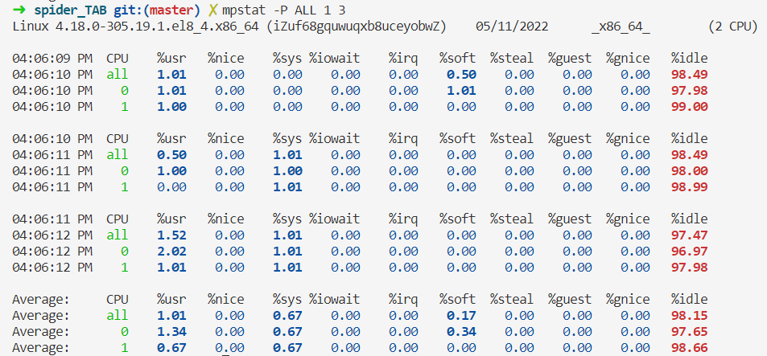
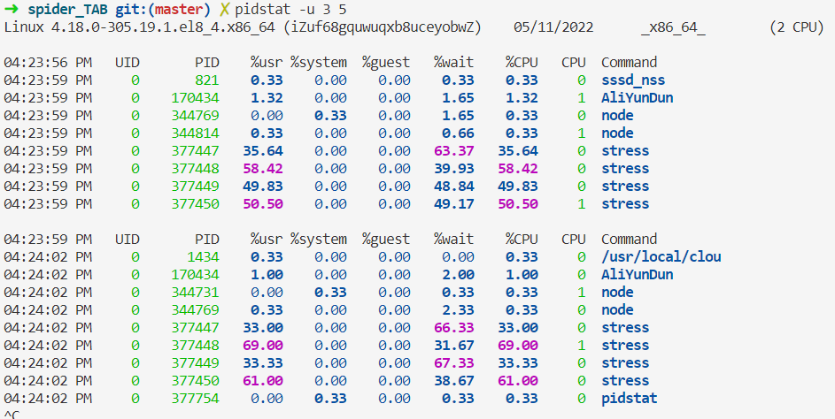
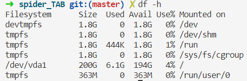

# 静态和动态库

## 静态库的制作

- 命名规则
  - Linux : libxxx.a
    - lib : 前缀 固定
    - xxx ： 库的名字，自己起
    - .a : 后缀 固定
  - Windows : libxxx.lib
- 

# centos 系统性能测试命令

## 进程 CPU

### top

查看总体情况

```wiki
第1行：系统时间、运行时间、登录终端数、系统负载（3个数值分别为1分钟、5分钟、15分钟内的平均值）。
第2行：进程总数、运行中的进程数、睡眠中的进程数、停止的进程数、僵死的进程数。
第3行：用户占用资源百分比、系统内核占用资源百分比、改变过优先级的进程资源百分比、空闲的资源百分比等。其中数据均为CPU数据并以百分比格式显示，例如“99.9 id”意味着有99.9%的CPU处理器资源处于空闲。
第4行：物理内存总量、内存空闲量、内存使用量、作为内核缓存的内存量。
第5行：虚拟内存总量、虚拟内存空闲量、虚拟内存使用量、已被提前加载的内存量。
```

```shell
top - 16:00:10 up 30 days,  4:28,  0 users,  load average: 0.62, 0.20, 0.07
Tasks: 110 total,   1 running, 109 sleeping,   0 stopped,   0 zombie
%Cpu(s):  0.7 us,  0.3 sy,  0.0 ni, 98.7 id,  0.2 wa,  0.2 hi,  0.0 si,  0.0 st
MiB Mem :   3625.5 total,    179.6 free,    657.5 used,   2788.4 buff/cache
MiB Swap:      0.0 total,      0.0 free,      0.0 used.   2701.6 avail Mem 

    PID USER      PR  NI    VIRT    RES    SHR S  %CPU  %MEM     TIME+ COMMAND
   1434 root      20   0 1364380  40112  11992 S   0.7   1.1 102:49.72 /usr/local/clou
 170434 root      10 -10  201600  50740  17720 S   0.3   1.4 103:17.49 AliYunDun
      1 root      20   0  186000  12972   8752 S   0.0   0.3   0:23.70 systemd
      2 root      20   0       0      0      0 S   0.0   0.0   0:00.36 kthreadd   
```

### mpstat

用来查看CPU情况

```wiki
用来查看CPU负载高的原因，mpstat命令写入每个可用处理器的标准输出活动，处理器0是第一个。还报告了所有处理器的全局平均活动。mpstat命令可以在SMP和UP机器上使用，但在后者中，只会打印全局平均活动。如果未选择任何活动，则默认报告为CPU利用率。
```



```shell
%user 在internal时间段里，用户态的CPU时间(%)，不包含nice值为负进程 (usr/total)100
%nice 在internal时间段里，nice值为负进程的CPU时间(%) (nice/total)100
%sys 在internal时间段里，内核时间(%) (system/total)100
%iowait 在internal时间段里，硬盘IO等待时间(%) (iowait/total)100
%irq 在internal时间段里，硬中断时间(%) (irq/total)100
%soft 在internal时间段里，软中断时间(%) (softirq/total)100
%idle 在internal时间段里，CPU除去等待磁盘IO操作外的因为任何原因而空闲的时间闲置时间(%) (idle/total)100
```

### pidstat

查看进程对CPU的影响


### stress

增加系统IO

```bash
stress --io 1000 --timeout 600
```

通过 `pidstat`查看哪个进程对CPU的影响。

```bash
pidstat -u 3 5
```


增加cpu的计算采用大量线程

```bash
stress -c 4 --timeout 600
```

不管是内核态的升高还是用户态的升高都会导致系统空闲程度的下降。




## 内存

查看内存大小

```bash
free -h
```


查看内存占用高的进程PID

```BASH
ps aux | sort -n -k 3 -r|head
```

## 磁盘

### df -h

查看磁盘容量 会显示磁盘占用的空间量 `Use%`如果有100%的就需要清理磁盘，一般先从日志文件下手。



### 磁盘负载

```bash
# 所依耐安装包
yum -y install sysstat

iostat -dmx 1 3
# 每秒显示一次显示三次。
```

```wiki
# 常用参数

-d         # 显示设备（磁盘）使用状态
-c         # 只显示CPU行
-k         # 以千字节为单位显示磁盘输出
-m         # 以每秒兆字节为单位显示统计信息
-t         # 在输出中包括时间戳
-x         # 在输出中包括扩展的磁盘指标

rrqm/s: 每秒进行 merge 的读操作数目。
wrqm/s: 每秒进行 merge 的写操作数目。
r/s: 每秒完成的读 I/O 设备次数。
w/s: 每秒完成的写 I/O 设备次数。
rsec/s: 每秒读扇区数。
wsec/s: 每秒写扇区数。
rkB/s: 每秒读K字节数。是 rsect/s 的一半，因为每扇区大小为512字节。(需要计算)
wkB/s: 每秒写K字节数。是 wsect/s 的一半。(需要计算)
avgrq-sz: 平均每次设备I/O操作的数据大小 (扇区)。
avgqu-sz: 平均I/O队列长度。
await: 平均每次设备I/O操作的等待时间 (毫秒)。
svctm: 平均每次设备I/O操作的服务时间 (毫秒)。
%util: 一秒中有百分之多少的时间用于 I/O 操作。

关于Merge的解释：当系统调用需要读取数据的时 候，VFS将请求发到各个FS，如果FS发现不同的读取请求读取的是相同Block的数据，FS会将这个请求合并Merge

await：每一个IO请求的处理的平均时间（单位是毫秒）。这里可以理解为IO的响应时间，一般地系统IO响应时间应该低于5ms，如果大于10ms就比较大了。

%util：在统计时间内所有处理IO时间，除以总共统计时间。例如，如果统计间隔1秒，该 设备有0.8秒在处理IO，而0.2秒闲置，那么该设备的%util = 0.8/1 = 80%，所以该参数暗示了设备的繁忙程度。一般地，如果该参数是100%表示设备已经接近满负荷运行了（当然如果是多磁盘，即使%util是100%，因 为磁盘的并发能力，所以磁盘使用未必就到了瓶颈）。
```

## 网络测试

### 网络带宽

```bash
# 服务端运行
[root@k8s ~]# iperf3 -s
# 客户端运行
[root@k8s net]# iperf3 -c IPAddress
```

### 查看网卡是否有丢包

```bash
# 查看error字段
[root@k8s ~]# ifconfig ens33
ens33: flags=4163<UP,BROADCAST,RUNNING,MULTICAST>  mtu 1500
        inet 10.4.7.10  netmask 255.255.255.0  broadcast 10.4.7.255
        inet6 fe80::20c:29ff:fe78:a8e1  prefixlen 64  scopeid 0x20<link>
        ether 00:0c:29:78:a8:e1  txqueuelen 1000  (Ethernet)
        RX packets 23719  bytes 26537409 (25.3 MiB)
        RX errors 0  dropped 0  overruns 0  frame 0
        TX packets 9663  bytes 1953840 (1.8 MiB)
        TX errors 0  dropped 0 overruns 0  carrier 0  collisions 0
```

```bash
[root@k8s ~]# ethtool -S ens33 |grep -i error
     rx_errors: 0
     tx_errors: 0
     rx_length_errors: 0
     rx_over_errors: 0
     rx_crc_errors: 0
     rx_frame_errors: 0
     rx_missed_errors: 0
     tx_aborted_errors: 0
     tx_carrier_errors: 0
     tx_fifo_errors: 0
     tx_heartbeat_errors: 0
     tx_window_errors: 0
     rx_long_length_errors: 0
     rx_short_length_errors: 0
     rx_align_errors: 0
     rx_csum_offload_errors: 0
```

```bash
[root@k8s ~]# ethtool ens33
Settings for ens33:
	Supported ports: [ TP ]
	Supported link modes:   10baseT/Half 10baseT/Full 
	                        100baseT/Half 100baseT/Full 
	                        1000baseT/Full 
	Supported pause frame use: No
	Supports auto-negotiation: Yes
	Supported FEC modes: Not reported
	Advertised link modes:  10baseT/Half 10baseT/Full 
	                        100baseT/Half 100baseT/Full 
	                        1000baseT/Full 
	Advertised pause frame use: No
	Advertised auto-negotiation: Yes
	Advertised FEC modes: Not reported
	Speed: 1000Mb/s
	Duplex: Full
	Port: Twisted Pair
	PHYAD: 0
	Transceiver: internal
	Auto-negotiation: on
	MDI-X: off (auto)
	Supports Wake-on: d
	Wake-on: d
	Current message level: 0x00000007 (7)
			       drv probe link
	Link detected: yes

# Speed: 1000Mb/s    # 网卡速率
# Duplex: Full       # 全双工
# Link detected: yes # 物理链路
```
