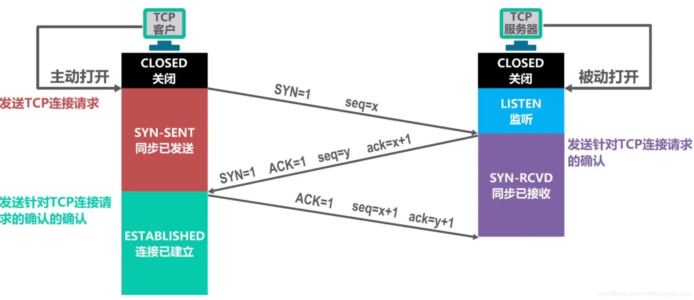
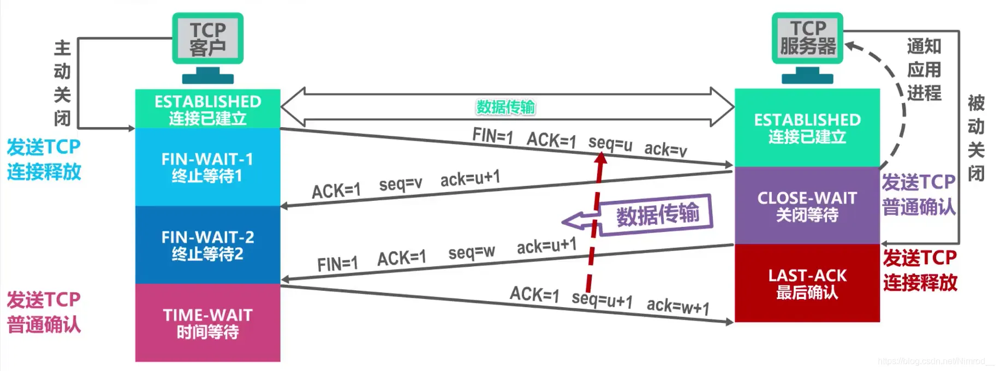

# 计算机网络

## 物理层有什么作用

主要解决两台物理机之间的通信，通过二进制比特流的传输来实现，二进制数据表现为电流电压上的强弱，到达目的地再转化为二进制机器码。

网卡、集线器工作在这一层。

## 数据链路层有什么作用

在不可靠的物理介质上提供可靠的传输，接收来自物理层的位流形式的数据，并封装成帧，传送到上一层；同样，也将来自上层的数据帧，拆装为位流形式的数据转发到物理层。这一层在物理层提供的比特流的基础上，通过差错控制、流量控制方法，使有差错的物理线路变为无差错的数据链路。

提供物理地址寻址功能。交换机工作在这一层。

## 网络层有什么作用

将网络地址翻译成对应的物理地址，并决定如何将数据从发送方路由到接收方，通过路由选择算法为分组通过通信子网选择最佳路径。

路由器工作在这一层。

## 传输层有什么作用

传输层提供了进程间的逻辑通信，传输层向高层用户屏蔽了下面网络层的核心细节，使应用程序看起来像是在两个传输层实体之间有一条端到端的逻辑通信信道。

## 会话层有什么作用

建立会话：身份验证，权限鉴定等；
保持会话：对该会话进行维护，在会话维持期间两者可以随时使用这条会话传输局；
断开会话：当应用程序或应用层规定的超时时间到期后，OSI会话层才会释放这条会话。

## 表示层有什么作用

对数据格式进行编译，对收到或发出的数据根据应用层的特征进行处理，如处理为文字、图片、音频、视频、文档等，还可以对压缩文件进行解压缩、对加密文件进行解密等。

## 应用层有什么作用

提供应用层协议，如HTTP协议，FTP协议等等，方便应用程序之间进行通信。

# TCP 和 UDP协议

## TCP与UDP区别

TCP作为面向**流**的协议，提供**可靠**的、面向**连接**的运输服务，并且提供**点对点**通信
UDP作为面向**报文**的协议，**不提供可靠**交付，并且**不需要连接**，**不仅仅对点对点，也支持多播和广播**

- udp是无连接的，tcp是面向连接的；
- udp是不可靠传输，tcp是可靠传输；
- udp是面向报文传输，tcp是面向字节流传输。

## 为何TCP可靠

TCP有三次握手建立连接，四次挥手关闭连接的机制。
除此之外还有滑动窗口和拥塞控制算法。最最关键的是还保留超时重传的机制。
对于每份报文也存在校验，保证每份报文可靠性。

## 为何UDP不可靠

UDP面向数据报无连接的，数据报发出去，就不保留数据备份了。
仅仅在IP数据报头部加入校验和复用。
UDP没有服务器和客户端的概念。
UDP报文过长的话是交给 IP 切成小段，如果某段报废报文就废了。

## 简述TCP粘包现象

TCP是面向流协议，发送的单位是字节流，因此会将多个小尺寸数据被封装在一个tcp报文中发出去的可能性。
可以简单的理解成客户端调用了两次send，服务器端一个recv就把信息都读出来了。

## TCP粘包现象处理方法

固定发送信息长度，或在两个信息之间加入分隔符。

## 简述TCP协议的滑动窗口

滑动窗口是传输层进行流量控制的一种措施，接收方通过通告发送方自己的窗口大小，从而控制发送方的发送速度，防止发送方发送速度过快而导致自己被淹没。

[窗口机制详细解释](https://blog.csdn.net/qq_40276626/article/details/120230202)

## 简述TCP协议的拥塞控制

[拥塞控制详解](https://blog.csdn.net/qq_41431406/article/details/97926927)

拥塞是指一个或者多个交换点的数据报超载，TCP又会有重传机制，导致过载。
为了防止拥塞窗口cwnd增长过大引起网络拥塞，还需要设置一个慢开始门限ssthresh状态变量.

当cwnd < ssthresh 时，使用慢开始算法。
当cwnd > ssthresh 时，停止使用慢开始算法而改用拥塞避免算法。
当cwnd = ssthresh 时，即可使用慢开始算法，也可使用拥塞避免算法。

慢开始：由小到大逐渐增加拥塞窗口的大小，每接一次报文，cwnd指数增加。

拥塞避免：cwnd缓慢地增大，即每经过一个往返时间RTT就把发送方的拥塞窗口cwnd加1。

快恢复之前的策略：发送方判断网络出现拥塞，就把ssthresh设置为出现拥塞时发送方窗口值的一半，继续执行慢开始，之后进行拥塞避免。

快恢复：发送方判断网络出现拥塞，就把ssthresh设置为出现拥塞时发送方窗口值的一半，并把cwnd设置为ssthresh的一半，之后进行拥塞避免。

## 简述快重传

如果在超时重传定时器溢出之前，接收到连续的三个重复冗余ACK，发送端便知晓哪个报文段在传输过程中丢失了，于是重发该报文段，不需要等待超时重传定时器溢出再发送该报文。

## TCP三次握手过程

1. 第一次握手:客户端将标志位SYN置为1，随机产生一个值序列号seq=x，并将该数据包发送给服务端，客户端
   进入syn_sent状态，等待服务端确认。
2. 第二次握手:服务端收到数据包后由标志位SYN=1知道客户端请求建立连接，服务端将标志位SYN和
   ACK都置为1，ack=x+1,随机产生一个值seq=y，并将该数据包发送给客户端以确认连接请求，服务端进入syn_rcvd状态。
3. 第三次握手:客户端收到确认后检查,如果正确则将标志位ACK为1，ack=y+1，并将该数据包发送给服务端，服务端进行检查如果正确则连接建立成功，客户端和服务端进入established状态，完成三次握手，随后客户端和服务端之间可以开始传输
   数据了

## 为什么TCP握手需要三次，两次行不行？

不行。TCP进行可靠传输的关键就在于维护一个序列号，三次握手的过程即是通信双方相互告知序列号起始值， 并确认对方已经收到了序列号起始值。

如果只是两次握手， 至多只有客户端的起始序列号能被确认， 服务器端的序列号则得不到确认。

## 简述半连接队列

TCP握手中，当服务器处于SYN_RCVD 状态，服务器会把此种状态下请求连接放在一个队列里，该队列称为半连接队列。

## 简述SYN攻击

SYN攻击即利用TCP协议缺陷，通过发送大量的半连接请求，占用半连接队列，耗费CPU和内存资源。

优化方式：

1. 缩短SYN Timeout时间
2. 记录IP，若连续受到某个IP的重复SYN报文，从这个IP地址来的包会被一概丢弃。

## TCP四次挥手过程

1. 第一次挥手：客户端发送一个FIN，用来关闭客户端到服务端的数据传送，客户端进入fin_wait_1状态。
2. 第二次挥手：服务端收到FIN后，发送一个ACK给客户端，确认序号为收到序号+1，服务端进入Close_wait状态。此时TCP连接处于半关闭状态，即客户端已经没有要发送的数据了，但服务端若发送数据，则客户端仍要接收。
3. 第三次挥手：服务端发送一个FIN，用来关闭服务端到客户端的数据传送，服务端进入Last_ack状态。
4. 第四次挥手：客户端收到FIN后，客户端进入Time_wait状态，接着发送一个ACK给服务端，确认后，服务端进入Closed状态，完成四次挥手。

## 为什么TCP挥手需要4次

主要原因是当服务端收到客户端的 FIN 数据包后，服务端可能还有数据没发完，不会立即close。

所以服务端会先将 ACK 发过去告诉客户端我收到你的断开请求了，但请再给我一点时间，这段时间用来发送剩下的数据报文，发完之后再将 FIN 包发给客户端表示现在可以断了。之后客户端需要收到 FIN 包后发送 ACK 确认断开信息给服务端。

## 简述DNS协议

DNS协议是基于UDP的应用层协议，它的功能是根据用户输入的域名，解析出该域名对应的IP地址，从而给客户端进行访问。

## 简述DNS解析过程

1、客户机发出查询请求，在本地**计算机缓存**查找，若没有找到，就会将请求发送给dns服务器

2、**本地dns服务器**会在自己的区域里面查找，找到即根据此记录进行解析，若没有找到，就会在本地的缓存里面查找

3、本地服务器没有找到客户机查询的信息，就会将此请求发送到**根域名dns服务器**

4、根域名服务器解析客户机请求的根域部分，它把包含的**下一级的dns服务器**的地址返回到客户机的dns服务器地址

5、客户机的dns服务器根据返回的信息接着访问**下一级的dns服务器**

6、这样递归的方法一级一级接近查询的目标，最后在有目标域名的服务器上面得到相应的IP信息

7、客户机的本地的dns服务器会将查询结果返回给我们的客户机

8、客户机根据得到的ip信息访问目标主机，完成解析过程

## 简述HTTP协议

HTTP 协议是超文本传输协议。它是基于TCP协议的应用层传输协议，即客户端和服务端进行数据传输的一种规则。该协议本身是一种无状态的协议。

## 简述cookie

HTTP 协议本身是无状态的，为了使其能处理更加复杂的逻辑，HTTP/1.1 引入 Cookie 来保存状态信息。

Cookie是由服务端产生的，再发送给客户端保存，当客户端再次访问的时候，服务器可根据cookie辨识客户端是哪个，以此可以做个性化推送，免账号密码登录等等。

## 简述session

session用于标记特定客户端信息，存在在服务器的一个文件里。
一般客户端带Cookie对服务器进行访问，可通过cookie中的session id从整个session中查询到服务器记录的关于客户端的信息。

## session与cookie的区别

#### 1、存储位置不同

> cookie的数据信息存放在客户端浏览器上。

> session的数据信息存放在服务器上。

#### 2、存储容量不同

> 单个cookie保存的数据<=4KB，一个站点最多保存20个Cookie。

> 对于session来说并没有上限，但出于对服务器端的性能考虑，session内不要存放过多的东西，并且设置session删除机制。

#### 3、存储方式不同

> cookie中只能保管ASCII字符串，并需要通过编码方式存储为Unicode字符或者二进制数据。

> session中能够存储任何类型的数据，包括且不限于string，integer，list，map等。

#### 4、隐私策略不同

> cookie对客户端是可见的，别有用心的人可以分析存放在本地的cookie并进行cookie欺骗，所以它是不安全的。

> session存储在服务器上，对客户端是透明的，不存在敏感信息泄漏的风险。

#### 5、有效期上不同

> 开发可以通过设置cookie的属性，达到使cookie长期有效的效果。

> session依赖于名为JSESSIONID的cookie，而cookie JSESSIONID的过期时间默认为-1，只需关闭窗口该session就会失效，因而session不能达到长期有效的效果。

#### 6、服务器压力不同

> cookie保管在客户端，不占用服务器资源。对于并发用户十分多的网站，cookie是很好的选择。

> session是保管在服务器端的，每个用户都会产生一个session。假如并发访问的用户十分多，会产生十分多的session，耗费大量的内存。

#### 7、浏览器支持不同

假如客户端浏览器不支持cookie：

> cookie是需要客户端浏览器支持的，假如客户端禁用了cookie，或者不支持cookie，则会话跟踪会失效。关于WAP上的应用，常规的cookie就派不上用场了。

> 运用session需要使用URL地址重写的方式。一切用到session程序的URL都要进行URL地址重写，否则session会话跟踪还会失效。

假如客户端支持cookie：

> cookie既能够设为本浏览器窗口以及子窗口内有效，也能够设为一切窗口内有效。

> session只能在本窗口以及子窗口内有效。

#### 8、跨域支持上不同

> cookie支持跨域名访问。

> session不支持跨域名访问。

## 简述http状态码和对应的信息

1XX：接收的信息正在处理

2XX：请求正常处理完毕

3XX：重定向

4XX：客户端错误

5XX：服务端错误

常见错误码：
301：永久重定向
302：临时重定向
304：资源没修改，用之前缓存就行
400：客户端请求的报文有错误
403：表示服务器禁止访问资源
404：表示请求的资源在服务器上不存在或未找到

## 转发和重定向的区别

转发是服务器行为。服务器直接向目标地址访问URL,将相应内容读取之后发给浏览器，用户浏览器地址栏URL不变，转发页面和转发到的页面可以共享request里面的数据。

重定向是利用服务器返回的状态码来实现的，如果服务器返回301或者302，浏览器收到新的消息后自动跳转到新的网址重新请求资源。用户的地址栏url会发生改变，而且不能共享数据。

## 简述http1.0

规定了请求头和请求尾，响应头和响应尾（get post）

每一个请求都是一个单独的连接，做不到连接的复用

## 简述http1.1的改进

HTTP1.1默认开启长连接，在一个TCP连接上可以传送多个HTTP请求和响应。使用 TCP 长连接的方式改善了 HTTP/1.0 短连接造成的性能开销。

支持管道（pipeline）网络传输，只要第一个请求发出去了，不必等其回来，就可以发第二个请求出去，可以减少整体的响应时间。

服务端无法主动push

## 简述HTTP短连接与长连接区别

HTTP中的长连接短连接指HTTP底层TCP的连接。

短连接： 客户端与服务器进行一次HTTP连接操作，就进行一次TCP连接，连接结束TCP关闭连接。

长连接：如果HTTP头部带有参数keep-alive，即开启长连接网页完成打开后，底层用于传输数据的TCP连接不会直接关闭，会根据服务器设置的保持时间保持连接，保持时间过后连接关闭。

## 简述http2.0的改进

提出多路复用。多路复用前，文件是串行传输的，请求a文件，b文件只能等待，并且连接数过多。引入多路复用，a文件b文件可以同时传输。

引入了二进制数据帧。其中帧对数据进行顺序标识，有了序列id，服务器就可以进行并行传输数据。

## http与https的区别

http所有传输的内容都是明文，并且客户端和服务器端都无法验证对方的身份。
https具有安全性的ssl加密传输协议，加密采用对称加密，
https协议需要到ca申请证书，一般免费证书很少，需要交费。

## 简述TLS/SSL, HTTP, HTTPS的关系

SSL全称为Secure Sockets Layer即安全套接层，其继任为TLSTransport Layer Security传输层安全协议，均用于在传输层为数据通讯提供安全支持。

可以将HTTPS协议简单理解为HTTP协议＋TLS/SSL

## https的连接过程

1. 浏览器将支持的加密算法信息发给服务器
2. 服务端收到这套加密算法的时候，和自己支持的加密算法进行对比。如果客户端加密算法符合服务端的加密算法，服务端将CA证书发送给客户端，此证书中包括了数字证书包含的内容：1、证书颁发机构；2、使用机构；3、公钥；4、有效期；5、签名算法；6、签名hash算法；7、指纹算法；8、指纹。
3. 客户端(SSL/TLS)解析证书验证证书合法性，生成对称加密的密钥（随机数），我们将该密钥称之为client key，即客户端密钥，用服务器的公钥对客户端密钥进行非对称加密。
4. 客户端会发起HTTPS中的第二个HTTP请求，将加密之后的客户端对称密钥发送给服务器
5. 服务器接收到客户端发来的密文之后，会用自己的私钥对其进行非对称解密，解密之后的明文就是客户端密钥，然后用客户端密钥对数据进行对称加密，这样数据就变成了密文。
6. 服务器将加密后的密文发送给客户端
7. 客户端收到服务器发送来的密文，用客户端密钥对其进行对称解密，得到服务器发送的数据。这样HTTPS中的第二个HTTP请求结束，整个HTTPS传输完成

## Get与Post区别

**GET** 用来获取资源，它只是获取、查询数据，不会修改服务器的数据，从这点来讲，它是安全的（后面还会从另一方面分析它的不安全性）。由于它是读取的，因此可以对 GET 请求的数据进行缓存。

**POST** 则是可以向服务器发送修改请求，进行数据的修改的。

1、GET请求一般用去请求获取数据，

​    POST一般作为发送数据到后台时使用

2、GET请求也可传参到后台，但是其参数在浏览器的地址栏的url中可见，所以隐私性安全性较差，且参数长度也是有限制的

​    POST请求传递参数放在Request body中，不会在url中显示，比GET要安全，且参数长度无限制

3、GET请求刷新浏览器或回退时没有影响

​    POST回退时会重新提交数据请求

4、GET 请求可被缓存

​    POST 请求不会被缓存

> 参考：[get请求和post请求区别 - 简书 (jianshu.com)](https://www.jianshu.com/p/a5cdfd2bda66)
>
> [GET 和 POST 的区别？ - 知乎 (zhihu.com)](https://zhuanlan.zhihu.com/p/135454697)

## Get方法参数有大小限制吗

一般HTTP协议里并不限制参数大小限制。但一般由于get请求是直接附加到地址栏里面的，由于浏览器地址栏有长度限制，因此使GET请求在浏览器实现层面上看会有长度限制。1024

## 浏览器中输入一个网址后，具体发生了什么

1. 进行DNS解析操作，根据DNS解析的结果查到服务器IP地址
2. 通过ip寻址和arp，找到服务器，并利用三次握手建立TCP连接
3. 浏览器生成HTTP报文，发送HTTP请求，等待服务器响应
4. 服务器处理请求，并返回给浏览器
5. 根据HTTP是否开启长连接，进行TCP的挥手过程
6. 浏览器根据收到的静态资源进行页面渲染

> 地址解析协议，即ARP（Address Resolution Protocol），是根据[IP地址](https://baike.baidu.com/item/IP地址)获取[物理地址](https://baike.baidu.com/item/物理地址/2129)的一个[TCP/IP协议](https://baike.baidu.com/item/TCP%2FIP协议)。[主机](https://baike.baidu.com/item/主机/455151)发送信息时将包含目标IP地址的ARP请求广播到局域网络上的所有主机，并接收返回消息，以此确定目标的物理地址；收到返回消息后将该IP地址和物理地址存入本机ARP缓存中并保留一定时间，下次请求时直接查询ARP缓存以节约资源。地址解析协议是建立在网络中各个主机互相信任的基础上的，局域网络上的主机可以自主发送ARP应答消息，其他主机收到应答报文时不会检测该报文的真实性就会将其记入本机ARP缓存；由此攻击者就可以向某一主机发送伪ARP应答报文，使其发送的信息无法到达预期的主机或到达错误的主机，这就构成了一个[ARP欺骗](https://baike.baidu.com/item/ARP欺骗)。[ARP命令](https://baike.baidu.com/item/ARP命令)可用于查询本机ARP缓存中IP地址和[MAC地址](https://baike.baidu.com/item/MAC地址)的对应关系、添加或删除静态对应关系等。相关协议有[RARP](https://baike.baidu.com/item/RARP)、[代理ARP](https://baike.baidu.com/item/代理ARP)。[NDP](https://baike.baidu.com/item/NDP)用于在[IPv6](https://baike.baidu.com/item/IPv6)中代替地址解析协议。

