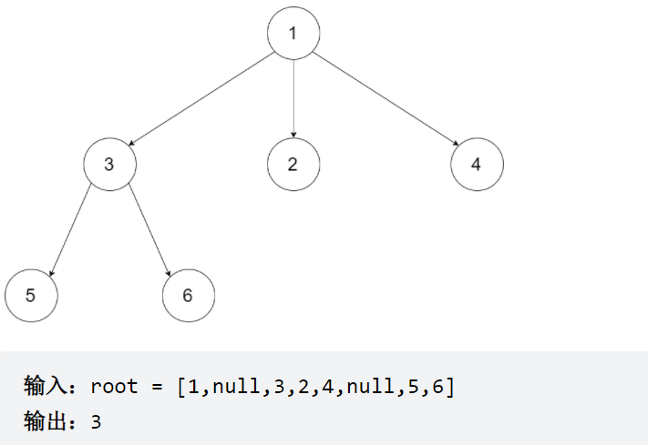

# [559. N 叉树的最大深度](https://leetcode-cn.com/problems/maximum-depth-of-n-ary-tree/)

<font color=#0f0> 简单</font>

给定一个 N 叉树，找到其最大深度。

最大深度是指从根节点到最远叶子节点的最长路径上的节点总数。

N 叉树输入按层序遍历序列化表示，每组子节点由空值分隔（请参见示例）。



```cpp
/*
// Definition for a Node.
class Node {
public:
    int val;
    vector<Node*> children;

    Node() {}

    Node(int _val) {
        val = _val;
    }

    Node(int _val, vector<Node*> _children) {
        val = _val;
        children = _children;
    }
};
*/

class Solution {
private:
    int res = 0;
public:
    void dfs(Node* root, int depth){
        if(!root) return;
        res = max(depth+1,res);
        for(auto child : root->children){
            dfs(child,depth+1);
        }
        return;
    }
    int bfs(Node* root){
        if(!root) return 0;
        queue<Node*> qu;
        qu.push(root);
        while(!qu.empty()){
            res += 1;
            int width = qu.size();
            for(int i = 0; i < levelCount; i++){
                Node* cur = qu.front();
                qu.pop();
                for(auto child : cur->children){
                    qu.push(child);
                }
            }
        }
    }
    int maxDepth(Node* root) {
		return bfs(root);
//      dfs(root,0);
//      return res;
    }
};
```

