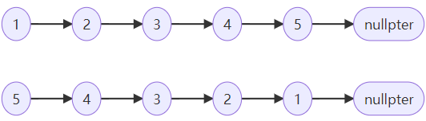

# 1. 反转链表

如下图所示，题目要求将链表反转。本文介绍迭代（双指针）、递归两种实现方法。



## 方法一： 迭代

```c++
class Solution {
public:
    ListNode* reverseList(ListNode* head) {
        ListNode *cur = head, *pre = nullptr;
        while(cur != nullptr) {
            ListNode* tmp = cur->next; // 暂存后继节点 cur.next
            cur->next = pre;           // 修改 next 引用指向
            pre = cur;                 // pre 暂存 cur
            cur = tmp;                 // cur 访问下一节点
        }
        return pre;
    }
};
```

```python
class Solution:
    def reverseList(self, head: ListNode) -> ListNode:
        cur, pre = head, None
        while cur:
            tmp = cur.next # 暂存后继节点 cur.next
            cur.next = pre # 修改 next 引用指向
            pre = cur      # pre 暂存 cur
            cur = tmp      # cur 访问下一节点
        return pre
```

## 方法二：递归

```cpp
class Solution {
public:
    ListNode* reverseList(ListNode* head) {
        return recur(head, nullptr);           // 调用递归并返回
    }
private:
    ListNode* recur(ListNode* cur, ListNode* pre) {
        if (cur == nullptr) return pre;        // 终止条件
        ListNode* res = recur(cur->next, cur); // 递归后继节点
        cur->next = pre;                       // 修改节点引用指向
        return res;                            // 返回反转链表的头节点
    }
};
```

```python
class Solution:
    def reverseList(self, head: ListNode) -> ListNode:
        def recur(cur, pre):
            if not cur: return pre     # 终止条件
            res = recur(cur.next, cur) # 递归后继节点
            cur.next = pre             # 修改节点引用指向
            return res                 # 返回反转链表的头节点
        
        return recur(head, None)       # 调用递归并返回
```

# 2. 复制复杂链表

请实现函数，复制一个复杂链表。在复杂链表中，每个节点除了有一个 next 指针指向下一个节点，还有一个 random 指针指向链表中的任意节点或者 null。


本题的难点在于每个链表多出了一个random指针，同过next的链表遍历无法完成random的复制。

因为random指针可能指向一个暂时还没有创建的节点拷贝。

为此提出两种方法：

## 方法一：哈希表

哈希表的方法即在用next指针遍历列表的时候，建立原节点和拷贝节点的对应关系。

然后通过第二次next指针遍历来完成random指针的拷贝。

- **时间复杂度 $O(N)$：** 两轮遍历链表，使用 O(N)*O*(*N*) 时间。
- **空间复杂度 $O(N)$ ：** 哈希表 `dic` 使用线性大小的额外空间。

```cpp
class Solution {
public:
    Node* copyRandomList(Node* head) {
        if(head == nullptr) return nullptr;
        Node* cur = head;
        unordered_map<Node*, Node*> map;
        // 1. 复制各节点，并建立 “原节点 -> 新节点” 的 Map 映射
        while(cur != nullptr) {
            map[cur] = new Node(cur->val);
            cur = cur->next;
        }
        cur = head;
        // 2. 构建新链表的 next 和 random 指向
        while(cur != nullptr) {
            map[cur]->next = map[cur->next];
            map[cur]->random = map[cur->random];
            cur = cur->next;
        }
        // 3. 返回新链表的头节点
        return map[head];
    }
};
```

```python
class Solution:
    def copyRandomList(self, head: 'Node') -> 'Node':
        if not head: return
        dic = {}
        # 1. 复制各节点，并建立 “原节点 -> 新节点” 的 Map 映射
        cur = head
        while cur:
            dic[cur] = Node(cur.val)
            cur = cur.next
        cur = head
        # 2. 构建新节点的 next 和 random 指向
        while cur:
            dic[cur].next = dic.get(cur.next)
            dic[cur].random = dic.get(cur.random)
            cur = cur.next
        # 3. 返回新链表的头节点
        return dic[head]
```

## 方法二：拼接+拆分

考虑构建如下图所示的拼接链表，如此便可在访问原节点的 random 指向节点的同时找到新对应新节点的 random 指向节点。


算法分三步进行：

- 复制节点并构建拼接链表；
- 复制新链表的random指针；
- 拆分两个链表，并返回新链表。

```c++
class Solution {
public:
    Node* copyRandomList(Node* head) {
        if(head == nullptr) return nullptr;
        Node* cur = head;
        // 1. 复制各节点，并构建拼接链表
        while(cur != nullptr) {
            Node* tmp = new Node(cur->val);
            tmp->next = cur->next;
            cur->next = tmp;
            cur = tmp->next;
        }
        // 2. 构建各新节点的 random 指向
        cur = head;
        while(cur != nullptr) {
            if(cur->random != nullptr)
                cur->next->random = cur->random->next;
            cur = cur->next->next;
        }
        // 3. 拆分两链表
        cur = head->next;
        Node* pre = head, *res = head->next;
        while(cur->next != nullptr) {
            pre->next = pre->next->next;
            cur->next = cur->next->next;
            pre = pre->next;
            cur = cur->next;
        }
        pre->next = nullptr; // 单独处理原链表尾节点
        return res;      // 返回新链表头节点
    }
};
```

```python
class Solution:
    def copyRandomList(self, head: 'Node') -> 'Node':
        if not head: return
        cur = head
        # 1. 复制各节点，并构建拼接链表
        while cur:
            tmp = Node(cur.val)
            tmp.next = cur.next
            cur.next = tmp
            cur = tmp.next
        # 2. 构建各新节点的 random 指向
        cur = head
        while cur:
            if cur.random:
                cur.next.random = cur.random.next
            cur = cur.next.next
        # 3. 拆分两链表
        cur = res = head.next
        pre = head
        while cur.next:
            pre.next = pre.next.next
            cur.next = cur.next.next
            pre = pre.next
            cur = cur.next
        pre.next = None # 单独处理原链表尾节点
        return res      # 返回新链表头节点
```

