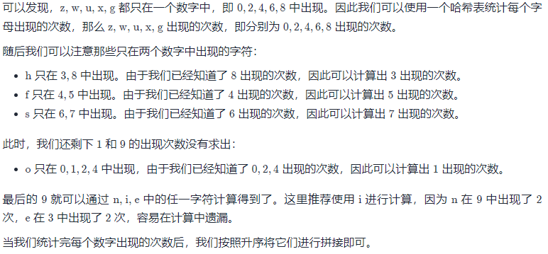

# [423\. 从英文中重建数字](https://leetcode-cn.com/problems/reconstruct-original-digits-from-english/)


给你一个字符串 `s` ，其中包含字母顺序打乱的用英文单词表示的若干数字（`0-9`）。按 **升序** 返回原始的数字。

**示例 1：**

```
输入：s = "owoztneoer"
输出："012"
```

**示例 2：**

```
输入：s = "fviefuro"
输出："45"
```

**提示：**

*   `1 <= s.length <= 10<sup>5</sup>`
*   `s[i]` 为 `["e","g","f","i","h","o","n","s","r","u","t","w","v","x","z"]` 这些字符之一
*   `s` 保证是一个符合题目要求的字符串


#### Solution

```cpp
class Solution {
public:
    string originalDigits(string s) {
        unordered_map<char, int> c;
        for (char ch: s) {
            ++c[ch];
        }

        vector<int> cnt(10);
        cnt[0] = c['z'];
        cnt[2] = c['w'];
        cnt[4] = c['u'];
        cnt[6] = c['x'];
        cnt[8] = c['g'];

        cnt[3] = c['h'] - cnt[8];
        cnt[5] = c['f'] - cnt[4];
        cnt[7] = c['s'] - cnt[6];

        cnt[1] = c['o'] - cnt[0] - cnt[2] - cnt[4];

        cnt[9] = c['i'] - cnt[5] - cnt[6] - cnt[8];

        string ans;
        for (int i = 0; i < 10; ++i) {
            for (int j = 0; j < cnt[i]; ++j) {
                ans += char(i + '0');
            }
        }
        return ans;
    }
};
```


首先我们可以统计每个字母分别在哪些数字中出现：


