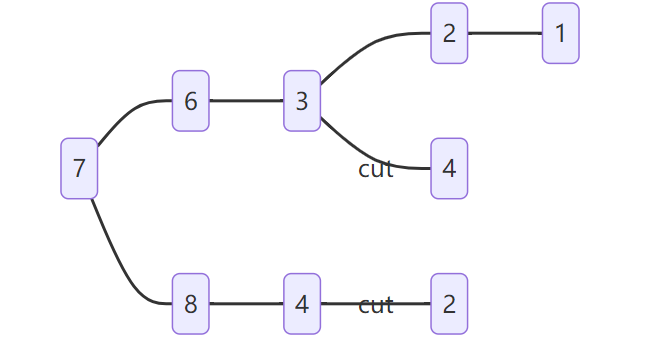

# [397. 整数替换](https://leetcode-cn.com/problems/integer-replacement/)

> 给定一个正整数 `n` ，你可以做如下操作：
>
> 1. 如果 `n` 是偶数，则用 `n / 2`替换 `n` 。
> 2. 如果 `n` 是奇数，则可以用 `n + 1`或 `n - 1`替换 `n` 。
> 3. `n` 变为 `1` 所需的最小替换次数是多少？

> **输入：**n = 7
> **输出：**4
> **解释：**7 -> 8 -> 4 -> 2 -> 1
> 或 7 -> 6 -> 3 -> 2 -> 1

## 方法一：·普通递归算法

```cpp
class Solution {
public:
    int integerReplacement(int n) {
        if (n == 1) {
            return 0;
        }
        if (n % 2 == 0) {
            return 1 + integerReplacement(n / 2);
        }
        return 2 + min(integerReplacement(n / 2), integerReplacement(n / 2 + 1));
    }
};
```

## 方法二：记忆化递归

记忆化递归使用多余的内存空间来换取较短的递归时间

实现 **递归树剪枝**




```cpp
class Solution {
private:
    unordered_map<int, int> memo;
public:
    Solution(){
        memo.push({0,1});
    }
    int integerReplacement(int n) {
        if (n == 1) return 0;
        if (memo.count(n)) return memo[n];
        if (n % 2 == 0)  return memo[n] = 1 + integerReplacement(n / 2);
        return memo[n] = 2 + min(integerReplacement(n / 2), integerReplacement(n / 2 + 1));
    }
};
//case 1: n 为 1 直接返回
//case 2: n 已知 直接返回
//case 3: n 为偶数 递归一次 并记忆
//case 4: n 为奇数 递归两次 并记忆
```
