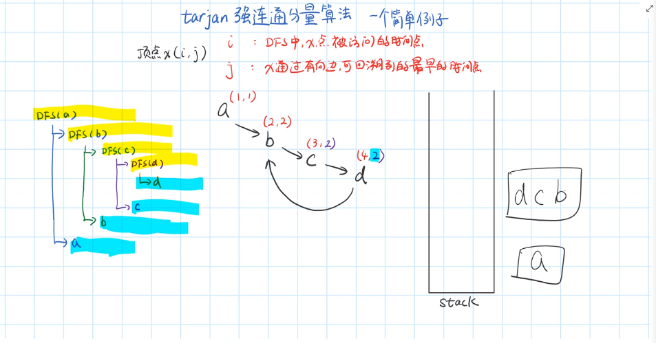

# 拓扑排序

使用队列（queue）的数据结构，将入度为 0 的节点逐一存入队列。

```cpp
bool topological_sort(vector<vector<int>> adjList, vector<int> indegree)
{
    int V = adjList.size();
    for(int i=0; i<V; ++i)
        if(indegree[i] == 0)
            q.push(i);         // 将所有入度为0的顶点入队

    int count = 0;             // 计数，记录当前已经输出的顶点数 
    while(!q.empty())
    {
        int v = q.front();      // 从队列中取出一个顶点
        q.pop();

        cout << v << " ";      // 输出该顶点
        ++count;
        // 将所有v指向的顶点的入度减1，并将入度减为0的顶点入栈
        for(nei : adjList[v])
            if(!(--indegree[nei]))
                q.push(nei);   // 若入度为0，则入栈
    }

    if(count < V)
        return false;           // 没有输出全部顶点，有向图中有回路
    else
        return true;            // 拓扑排序成功
}
```

无向图的桥和割点

// tarjan 算法求无向图的桥



