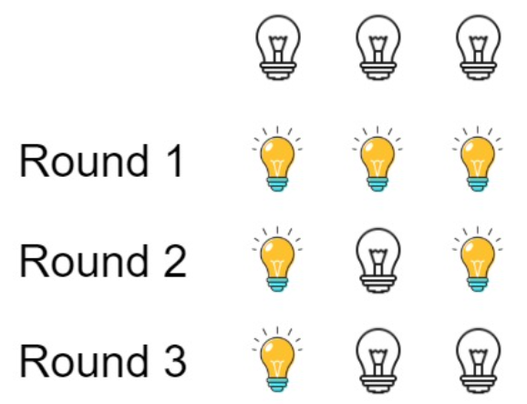

# 题目：319. 灯泡开关

链接：https://leetcode-cn.com/problems/bulb-switcher/

## 描述

初始时有 n 个灯泡处于关闭状态。

第一轮，你将会打开所有灯泡。

第二轮，你将会每两个灯泡关闭一个。

第三轮，你每三个灯泡就切换一个灯泡的开关（即，打开变关闭，关闭变打开）。

第 i 轮，你每 i 个灯泡就切换一个灯泡的开关。直到第 n 轮，你只需要切换最后一个灯泡的开关。

对于第 $k$ 个灯泡，

找出并返回 n 轮后有多少个亮着的灯泡。



## 相关概念

数论：因数个数

- 一个数的因数个数只有在该数为完全平方数的时候才是奇数。

## C++ 代码

```cpp
class Solution {
public:
    int bulbSwitch(int n) {
        return sqrt(n+0.5);
    }
};
```

## python 3 代码

```python
class Solution:
    def bulbSwitch(self, n: int) -> int:
        return int(sqrt(n + 0.5))
```

## 技巧总结

1-n 范围内的完全平方数个数为 sqrt(n)向下取整。
